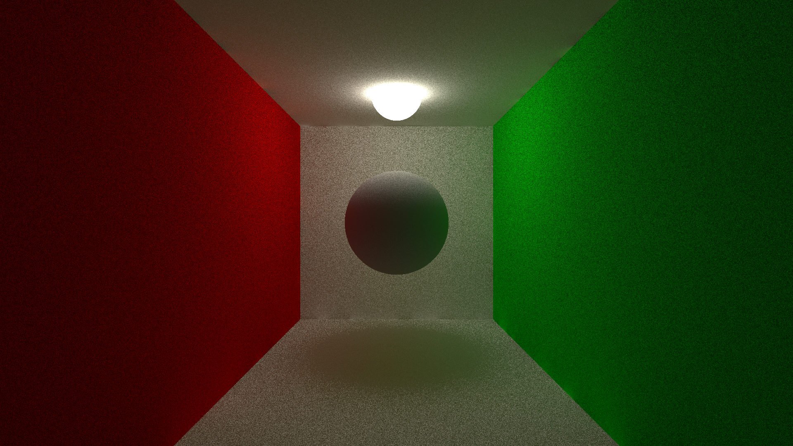
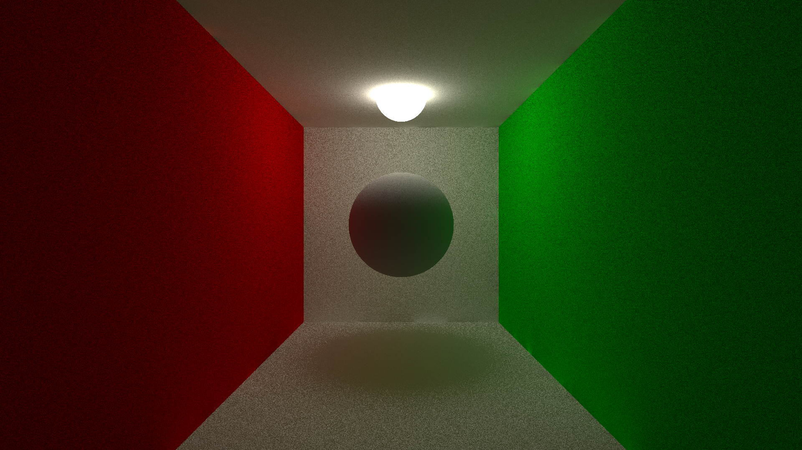
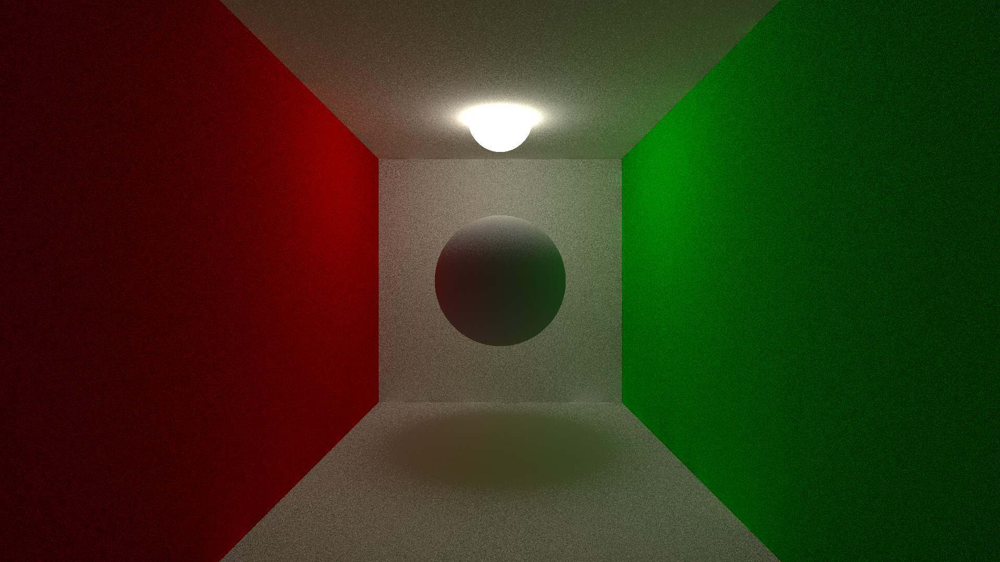
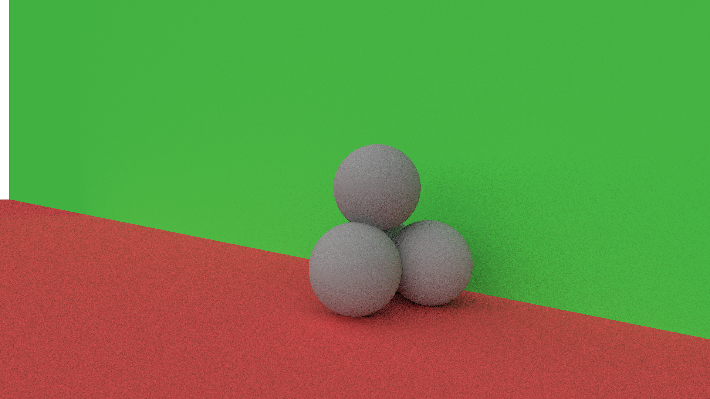
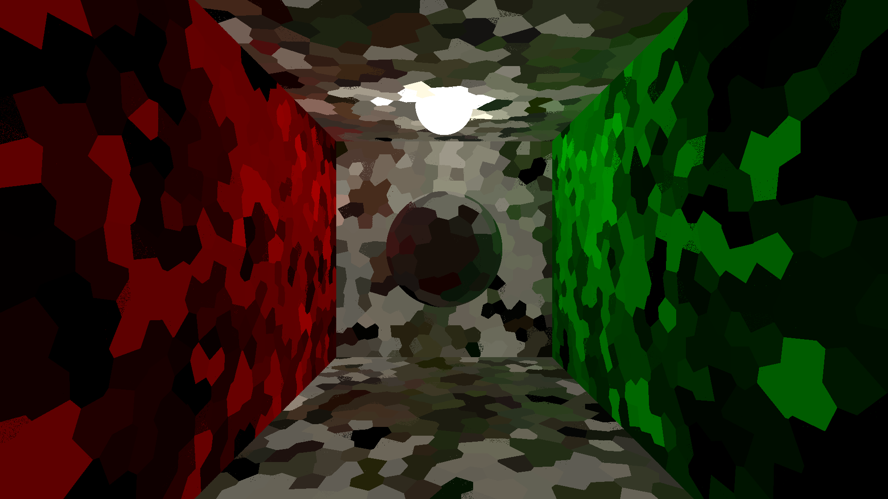

# Irradiance Caching

This is a small project aiming to experiment with irradiance caching. It's an offline CPU renderer, that takes a geometry and parameters as input and produces an image (file) as a result.

The entry point is at: irrad/src/main/App.java

See the launcher config in .vscode/launch.json

## Core idea
* Take a static geometry and a fixed camera
* Trace rays originating from the camera with the given bounce count
* If the last bounce hits a known entry (stored in a spacial data structure), then skip
* Otherwise calculate diffuse light as usual and store
* Reduce the bounce count and repeat the previous procedure, but now use teh previously created irradiance cache and include it in diffuse light calculation

## Configuration
* Depth limit: App.java / `new Renderer(scene, `__DEPTH_LIMIT__`, capacity);`
* Resolution of the image: App.java `renderer.render(camera, `__WIDTH__`, `__HEIGHT__`);`
* Cosine sampling: Renderer.java / `mCosineSampling`
* Stratified sampling: Renderer.java / `mDivisionX`; `mDivisionY`; `mSamples` (make sure `mSamples` is divisible by the multiple of the other two)
* Cache granularity: Renderer.java / `mCacheRadius` and `mCacheCos`

## Images
### Uniform sampling
The sampling used in the Monte Carlo integration uses a uniform distribution over the hemisphere above the surface and cosine weights.

### Uniform stratified sampling
The hemisphere is subdivided into small areas (linear subdivision in spherical coordinates) and samples are distributed evenly among the areas. The distribution of the samples is still uniform within each area.

### Cosine stratified sampling
The probability distributes and the weight function are replaced, producing samples with cosine-based probability distribution, but all samples have equal weights. Stratification is also added.

### Visualization of the irradiance cache
